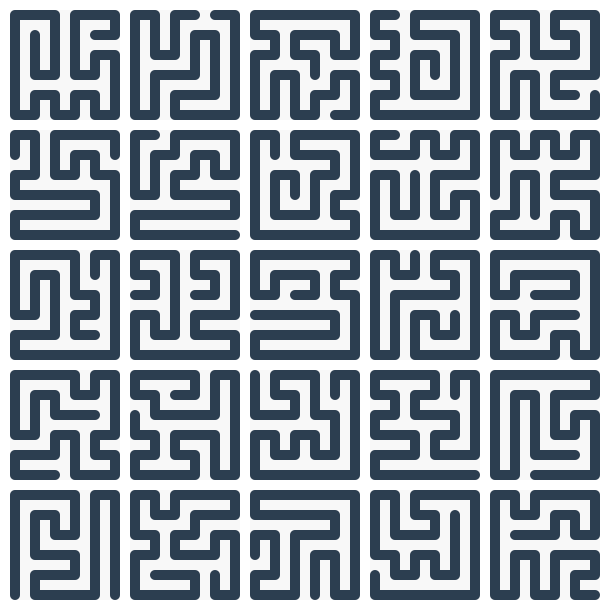

# NatsumeGlyph Dataset

Here is a collection of Hamiltonian paths on square grid graphs.
Each path visits every vertex exactly once, and each is stored in a canonical orientation (a path and its reverse are treated as a single item).

## Scope

The set covers five grid sizes.
Here, $n = \mathrm{size} + 2$.

| size | Grid | Vertices | Steps per path | Paths   |
| ---- | ---- | -------- | -------------- | ------- |
|    0 |  2x2 |        4 |              3 |       4 |
|    1 |  3x3 |        9 |              8 |      20 |
|    2 |  4x4 |       16 |             15 |     276 |
|    3 |  5x5 |       25 |             24 |   4,324 |
|    4 |  6x6 |       36 |             35 | 229,348 |

Total paths: **233,972**.

## Directory Layout

At top level, each size keeps its own folder:

- `0/`, `1/`, `2/`, `3/`, `4/`

Within each size folder:

- `{size}.json` holds all metadata records for that size.
- SVG files are arranged in a classification tree.

A typical SVG lives at:

```text
{size}/sym_*/turns_*/longest_run_*/longest_segment_*/max_count_*/min_count_*/angle_*/manhattan_*/signed_abs_*/edge_touch_*/exposure_*/turn_*/{size}_{id}.svg
```

## SVG Files

Each SVG draws one Hamiltonian path as a single SVG `<path>` stroke.

- Filename: `{size}_{id}.svg`
- Coordinate map:
  $$\phi(x,y) = (2x + 0.5,\ 2y + 0.5).$$
- ViewBox for an $n \times n$ grid: `0 0 (2n - 1) (2n - 1)`
  - The rightmost/lowermost center is at $2n - 1.5$; with `stroke-width=1`, the visible stroke reaches exactly $2n - 1$.
- Direction convention: `0=right`, `1=down`, `2=left`, `3=up`

## JSON Records

Each `{size}.json` is an array of records; a record has this shape:

```json
{
  "id": 0,
  "path": {
    "hex": "06",
    "length": 3
  },
  "position": {
    "start": { "x": 0, "y": 0 },
    "end": { "x": 0, "y": 1 }
  },
  "distance": {
    "manhattan": 1
  },
  "geometry": {
    "segments": {
      "lengths": [1, 1, 1],
      "min": 1,
      "max": 1,
      "counts": { "1": 3 },
      "min_count": 3,
      "max_count": 3
    },
    "angle": 2,
    "edges": 5
  },
  "turns": {
    "total": 2,
    "left": 0,
    "right": 2,
    "signed": 2,
    "longest_run": 2,
    "direction": "right"
  },
  "exposure": "both_vertex",
  "symmetry": {
    "transforms": {
      "mirror_h": 0,
      "mirror_v": 2,
      "rot_90": 1,
      "rot_180": 2,
      "rot_270": 3,
      "mirror_d": 1,
      "mirror_a": 3
    },
    "properties": {
      "mirror_h": true,
      "mirror_v": false,
      "rot_90": false,
      "rot_180": false,
      "rot_270": false,
      "mirror_d": false,
      "mirror_a": false
    },
    "label": "H"
  },
  "groups": {
    "dihedral": 0,
    "endpoints": 0
  }
}
```

### Core Fields

- `id`: path identifier used in the SVG filename.
- `path.hex`: hex-encoded move sequence.
- `path.length`: move count ($n^2 - 1$).
- `position.start`: start coordinate `{x, y}`.
- `position.end`: end coordinate `{x, y}`.

### Geometry and Turn Fields

- `distance.manhattan`: `abs(position.end.x - position.start.x) + abs(position.end.y - position.start.y)`.
- `geometry.segments.lengths`: maximal straight segment lengths, in moves.
- `geometry.segments.min`, `geometry.segments.max`: min/max of those segment lengths.
- `geometry.segments.counts`: histogram of segment length frequencies.
- `geometry.segments.min_count`: number of segments with length equal to `min`.
- `geometry.segments.max_count`: number of segments with length equal to `max`.
- `turns.total`: number of non-straight direction changes.
- `turns.left`, `turns.right`: left/right turn counts.
- `turns.signed`: `turns.right - turns.left`.
- `turns.longest_run`: longest sustained run of turns in one rotational sense.
  - Let $\delta_t = (dir_{t+1} - dir_t + 4) \bmod 4$.
  - Build turn sense by reading `delta_t` values: `1`=right, `3`=left, `0`=straight (ignored), `2`=reverse (run separator).
  - `longest_run` is the maximum run length of identical non-zero turn sense (`delta=0` is skipped and does not terminate a run).
- `geometry.angle`:
  - Let $u$ be the first move vector and $v$ be the last move vector.
  - `0` if $u \cdot v = 1$ (parallel, same direction)
  - `1` if $u \cdot v = 0$ (perpendicular)
  - `2` if $u \cdot v = -1$ (antiparallel, opposite direction)
- `geometry.edges`: boundary-contact event count.
  - Let the working path vertices be `v_0, ..., v_L` with `L = path.length`.
  - Let $B = \{(x,y) \mid x=0 \text{ or } y=0 \text{ or } x=n-1 \text{ or } y=n-1\}$.
  - Then:
    $$\mathrm{edges} = I(v_0 \in B) + I(v_L \in B) + \sum_{t=0}^{L-1} I(v_t \in B \ \text{or}\ v_{t+1} \in B).$$
    Here, $I(\cdot)$ is the indicator function (1 if true, 0 otherwise).
- `exposure`: endpoint exposure class (see vocabulary below).
- `turns.direction`: `right`, `left`, or `none` according to turn bias.

### Symmetry and Equivalence Fields

- `symmetry.properties`: seven boolean flags for path invariance under dihedral group D4 (square symmetries) transforms.
  - Each flag is `true` when the corresponding transform maps the path to itself (as determined by `symmetry.transforms`).
  - Keys: `mirror_h`, `mirror_v`, `rot_90`, `rot_180`, `rot_270`, `mirror_d`, `mirror_a`.
- `symmetry.transforms`: record IDs obtained by applying each dihedral transform.
- `symmetry.label`: compact label summarizing non-trivial symmetries:
  - `H`: horizontal mirror symmetry (`mirror_h` is true)
  - `V`: vertical mirror symmetry (`mirror_v` is true)
  - `R2`: 180° rotational symmetry (`rot_180` is true)
  - `none`: no symmetry
- `groups.dihedral`: class ID under dihedral group D4 equivalence.
- `groups.endpoints`: class ID by unordered endpoint pair.

## Path Encoding

Moves are coded as base-4 digits:

| Digit | Move  |
| ----- | ----- |
|     0 | right |
|     1 | down  |
|     2 | left  |
|     3 | up    |

Encoding steps:

1. Read the move string as a base-4 integer.
2. Convert that integer to hex.
3. Left-pad with zeros to width $\lceil \mathrm{pathLen} / 2 \rceil$.

Decoding is the reverse:

1. Parse `path` as hex.
2. Convert to base-4.
3. Left-pad to exactly `pathLen` digits.

The decoded move string is used consistently for path geometry and all derived fields.

Example:

- moves `012`
- base-4 value = 6
- hex = `06`

## Classification Vocabulary (Directory Names)

- `sym_H`, `sym_V`, `sym_R2`, `sym_none`: from `symmetry.label` (H=horizontal mirror, V=vertical mirror, R2=180° rotation, none=no symmetry).
- `turns_N`: from `turns.total`.
- `longest_run_N`: from `turns.longest_run`.
- `longest_segment_N`: longest straight-run (segment) length in the path.
- `max_count_N`: from `geometry.segments.max_count`.
- `min_count_N`: from `geometry.segments.min_count`.
- `angle_0`, `angle_1`, `angle_2`: from the `geometry.angle` field.
- `manhattan_N`: from `distance.manhattan`.
- `signed_abs_N`: `abs(turns.signed)`.
- `edge_touch_N`: from `geometry.edges`.
- `turn_right`, `turn_left`, `turn_none`: from `turns.direction`.

Exposure folders:

- `exposure_both_vertex`
- `exposure_both_exposed_one_vertex`
- `exposure_both_exposed_no_vertex`
- `exposure_one_exposed_vertex`
- `exposure_one_exposed_no_vertex`
- `exposure_none_exposed`

## Canonical Orientation

A path and its reversal are treated as one object.
Let `f` be the decoded base-4 move string, left-padded to length `pathLen`.
Let `g` be `f` reversed, with each digit $d$ replaced by $(d + 2) \bmod 4$ (that is, `0` and `2` swap, and `1` and `3` swap).
The stored representative is the lexicographically smaller of `f` and `g`.
The stored `(x, y)` is the start vertex for that chosen representative string.

## Examples

The [`examples/`](examples/) directory contains sample scripts demonstrating dataset usage.

### Random Tiling

[`examples/python/tile_random_paths.py`](examples/python/tile_random_paths.py) — Randomly select 25 paths from a size and arrange them in a 5×5 grid.

  
*Output PNG.*

## License

Licensed under **Creative Commons Attribution 4.0 International (CC BY 4.0)**.
See [`LICENSE`](/LICENSE) for the full notice.
